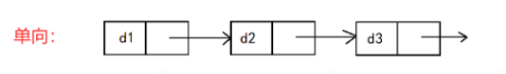

# 概述

算法库2.0为算法库1.0的迭代版本，算法库2.0适配各个项目、平台(前雷达和角雷达)
775S和776平台支持并行架构。

775S雷达：具体介绍详见官网 [STA77-5 77GHz高分辨远程雷达\_芜湖森思泰克智能科技有限公司\_毫米波雷达\_激光雷达\_雷达传感器](https://www.whst.com/product/34.html)
	基于77GHz-MIMIC技术
	单帧生成800个点云；运动航迹32个；静止航迹48个（算法库内部起始航迹24个）
	最远探测距离210m（算法可提供308m目标）
	集成FCW,AEB,ACC功能

算法库2.0的核心算法主要包含以下六部分：

1. 点云处理模块
   1. 传感器速度分解：车的横纵速和雷达的横纵速并不是1:1匹配的，存在一个相对速度补偿。
   2. 拟合车速点云筛选&车速拟合：
   3. 动静分离门限
2. 自车信息处理模块
   1. 自车位姿计算
   2. 车道 线模型
   3. 自车状态判断（加减速、转弯、坡道等）
   4. 感兴趣区域（ROI）设置
3. 处理场景模块
   1. 航迹预测优先级
   2. 矩形框框选办法
   3. 框选航迹的关联点云门限
   4. 场景识别方法
4. 静止场景模块
   1. 扫描道路边缘
   2. 拟合道路边缘
   3. 虚拟车道信息
5. 聚类模块
   1. 剔除杂波方法
   2. 标记多径聚类
6. 航迹模块
   1. 航迹更新
   2. 起始航迹虚警抑制
   3. 航迹合并

# 模型架构

## 串/并行架构

ARM核(Advanced RISC Machines)是RISC处理器，是精简指令集，具有低功耗、高性能的特点。数据处理中的部分耗时操作可以放在Arm核上进行。
DSP核(digital singnal processor)有自己的完整指令集，有强大的数据处理能力和较高的运行速度。信号处理部分都在DSP核上进行。


## 程序执行顺序

程序执行顺序与后续调试顺序相反，如下图所示，为程序执行顺序，无论最终实现为并行架构还是串行架构，最终 执行顺序 都可以认为 处理点云 处理聚类 处理航迹 ，其他模块均为辅助性质的模块。
在路测、 RTK 问题分析过程中， 调试顺序为 调试航迹、场景(策略)、调试聚类、调试点云 。


在独立介绍完模块后，首先，需要通过串结各个模块间的数据流动，帮助理解2.0 算法框架；其次，会罗列出可用价值性信息列表 ==(详见第三章)== ，比如 **自车当前状态信号急加急减速状态位、坡度信息、颠簸标志** ；聚类信息给出**关键点信息、聚类中子聚类个数、栅格化之后的密度；场景识别信息**；航迹信息给出**遮挡、道路边界距离、自车轨迹距离、相邻航迹信息**等，帮助后续调试、补充策略。

# 算法库2.0数据输入与输出

# 第一章 算法库2.0关键模块及理论推导

## 1.点云处理模块

### 1.1 传感器速度分解

车速是以自车后轴中心为原点提供的横纵速。雷达能提供雷达安装处为原点到目标的相对速度。
车速与雷达安装位置的速度不是完全的1:1关系，而是存在运动补偿，原理如下：

假设左前雷达安装在 $S_1(R_x, R_y)$ 处,已知自车过弯时，角速度为 $\omega$ ,转弯时，自车各位置**角速度一致；圆心一致。**  角速度参与运算的单位是弧度rad

自车车速 $V_0$ 为自车后轴中心 $E_0$ 处的线速度。左前雷达处的速度 $V_1$ 为 $S_1$ 处的线速度。

$$
\{\begin{array}{l}
v_0 = R_0 \omega  \\
v_1 =  R_2 \omega
\end{array}
$$

由此可得公式(1.1-1)：

$$
v_1 = \frac{R_2}{R_0}v_0
$$

自车车速在自车坐标系的分解结果如公式(1.1-2)：**(自车坐标系即以自车后轴中心为原点，正前方为X轴正极，左侧为Y轴正极)**

$$
\{\begin{matrix}
v_x = v_0 \\
v_y = 0
\end{matrix}
$$

左前雷达在自车坐标系的速度分解如公式(1.1-3)：

$$
\{\begin{array}{l}
v_{1x} = v_1 \cos{\alpha}\\
v_{1y} = v_1 \sin{\alpha} 
\end{array}
$$

根据几何关系可推出 $\sin{\alpha},\cos{\alpha}$  如公式(1.1-4):

$$
\begin{array}{l}
\sin{\alpha} = \frac{R_{x}}{R_{2}}\\
\cos{\alpha} = \frac{R_{1}}{R_{2}} = \frac{R_{0}-R_{y}}{R_{2}}=\frac{v_{0}-R_{y} \omega}{R_{2} \omega}
\end{array}
$$

联立上式(1.1-1, 1.1-2, 1.1-3, 1.1-4)消元后可得：

$$
\{\begin{array}{l}
v_{1x} = v_0-\omega R_y \\
v_{1y} = \omega R_x
\end{array}
$$

在算法库中的代码处理如下：

```c
// mainAlgDataProcess -> mainPointCloudProcess -> Pc_getSensorVelocity
/**
 * @brief 分解传感器速度
 * @ingroup PC_SENSOR_VELOCITY_GROUP
 * @param sensorParams 传感器信息结构体
 * @param egoCar 自车信息结构体
 * 
 * ```
 * graph LR
 * A(开始)-->B[计算纵向速度]-->C[计算横向速度]-->D(结束)
 * ```
 */
void Pc_getSensorVelocity(SensorParams_t *sensorParams,
                          EgoCarModule_t *egoCar)
{
#if(0)
	monitorGetCrushFlag(&gpMonitorAlgModule->monitorAlgCrash, "Pc_getSensorVelocity - ",
		sizeof("Pc_getSensorVelocity - "), 1, 0);
#endif

    // 初始化
    SensorInstallParams_t *installParams = &(sensorParams->installParams);
    SensorMoveParams_t *sensorMoveParams = &(sensorParams->sensorMoveParams);

    // 分解vx和vy
    sensorMoveParams->vx = -(sensorMoveParams->velocity -
                             sensorMoveParams->yawRate * installParams->ry);
    sensorMoveParams->vy = -sensorMoveParams->yawRate * installParams->rx;
}
```

这里取反是因为雷达速度就是雷达测得静止目标的横纵速度，但是方向是相反的。
(这里要记住sensorMoveParams->vx,vy的方向，不取反就是雷达速度，因为后面用这两个参数计算StaticDoppler是要取反的，所以在这里计算就取了反，指的是雷达测得静止目标的相对横纵速。)

### 1.2 拟合车速点云筛选&车速拟合

### 1.3 动静分离

#### 1.3.1 动静分离原理及公式推导

在1.1传感器速度分解，基于车速$v_{0}$和横摆角$\omega$得到了雷达的横纵速 $v_{1x},v_{1y}$

下面推出了雷达横纵速与不同方位角$\theta$ 对应静止点云doppler的关系。（PPT坐标系跟本文档定义坐标系不同，以文档的公式为准）

对应方位角 $\theta$ 的点云$i$ 的doppler为 $d_i=-(v_{1x}\cos{\theta_{i}}-v_{1y}\sin{\theta_{i}})$

左前雷达方位角 $\theta$ 的静止点云 $i$ 的doppler为(按照蓝色位置的方位角$\alpha$推导角度的正方向反了，这也是为什么PPT和实际代码不一样，正确推导应该按照紫色位置的方位角$\gamma$)

$$
\begin{aligned}
-d_{i}&=v_{1}\cos{(\alpha+\beta)}\\
&=v_{1}\cos{\alpha}\cos{\beta} - v_{1}\sin{\alpha}\sin{\beta}\\
&=v_{1x}\cos{\beta}-v_{1y}\sin{\beta}\\
d_{i}&=v_{1y}\sin{\beta}-v_{1x}\cos{\beta}
\end{aligned}
$$

$$
\begin{aligned}
-d_{i}&=v_{1}\cos{(\gamma-\alpha)}\\
&=v_{1}\cos{\gamma}\cos{\alpha} + v_{1}\sin{\gamma}\sin{\alpha}\\
&=v_{1x}\cos{\gamma}+v_{1y}\sin{\gamma}\\
\end{aligned}
$$

将横纵速和点云所在方位角可合成点云所在方位角下的静止目标Doppler：StaticDoppler（代码中在求得$v_{1x},v_{1y}$的时候就取负，所以这里求得的StaticDoppler就是公式里的$-d_{i}$）

也就是说当前方位角的点云 diffDoppler和Doppler的差值就是StaticDoppler

```c


// cross-platform-alg-lib\src\pc\pc_extend_info.c
// mainAlgDataProcess -> mainPointCloudProcess -> Pc_extendInfo
void Pc_extendInfo(Point_currPointModule_t *currPointModule,
                   Ego_pose_t *pose,
                   SensorParams_t *sensorParams)
// 遍历点云, 扩展信息
for (i = 0; i < pointsNum; i++)
{
	// 求点云的对地doppler
#if (M_PROJECT_CODE_MODE == M_STA77_6_PALTFORM)
	cosPitch = cosf_API(pointsInfo[i].pitch * M_INT_2_METER * M_DEGREE_TO_RADIUS);
#endif
	staticDoppler = sensorMoveParams->vx * cosf_API(pointsInfo[i].azimuthInRadar) * cosPitch +
					sensorMoveParams->vy * sinf_API(pointsInfo[i].azimuthInRadar) * cosPitch;
	pointsInfo[i].diffDoppler = (int16_t)(pointsInfo[i].doppler - staticDoppler * M_METER_2_INT);
	// 解模糊
	pointsInfo[i].diffDoppler = unrollAmbiValue_int2(sensorParams->waveformParams->dopplerAmbiPeriodHalf_int,
													 sensorParams->waveformParams->dopplerAmbiPeriodRec_int,
													 0, pointsInfo[i].diffDoppler);
	 ...
}
```


自车直行时，若点云的doppler满足 $|d_{i} + V\cos{\theta_{i}}| < \epsilon$， 则该点为静止点云。（直行车速$V$就是纵速$V_{x}$）

自车转弯时，车轮转角$\beta$就是转弯时车的速度方向(雷达的速度方向)。
因此左前雷达速度 $V_{lf}$ 分解为前面1.1求得的横纵速 $V_{1x},V_{1y}$如下：

$$
\{\begin{array}{l}
v_{1x} = V_{lf}\cos{\beta}\\
v_{1y} = -V_{lf}\sin{\beta}
\end{array}
$$

左前雷达方位角 $\theta$ 的静止点云 $i$ 的doppler为

$$
\begin{aligned}
d_{i}&=V_{lf}\cos{(\alpha+\beta)}\\
&=V_{lf}\cos{\beta}\cos{\alpha} - V_{lf}\sin{\beta}\sin{\alpha}\\
&=v_{1x}\cos{\alpha}+v_{1y}\sin{\alpha}
\end{aligned}
$$


这个PPT不知道为什么要算车轮转角，方位角的staticDoppler已经把车轮转角消掉了。


#### 1.3.1 动静分离门限

## 2.自车信息处理

### 2.1 自车位姿计算

### 2.2车道线模型

### 2.3自车状态判断

### 2.4 感兴趣区域设置

## 3.处理场景模块

## 4.静止场景模块

## 5.聚类模块

## 6.航迹模块

### 6.1 航迹更新

#### 6.1.1 更新航迹点云链表

##### 6.1.1.1 当前帧点云单向链表

当前帧点云使用**单向链表**连接进行聚类。（当前帧点云量小，且当前帧点云无先后顺序）

```c
/** [des] 该航迹当前帧点云数目，也是该航迹对应聚类的pointsNum, [uni] 1, [ini] 0, [min] 0, [max] M_MAX_CLOUD_POINTS_NUM */
if (NULL != trackInfo->clusterInfo)
{
	trackInfo->existState.pointsNum = trackInfo->clusterInfo->pointsNum;
}
```

航迹的当前帧点云用聚类的点云首尾指针地址之间赋值过来；聚类的点云来自于框聚类和DBSCAN聚类点云的赋值。


```c
// mainTrackProcess(跟踪) -> Track_stableTrackRun(稳定航迹跟踪) -> Track_updateTrack(更新过程)
trackInfo->cidHead = clusterInfo->cidHead;
trackInfo->cidRear = clusterInfo->cidRear;
```

##### 6.1.1.2 历史帧点云双向链表

**历史帧点云也叫积累点云。**
历史帧点云的首地址为时间最久远的点云，尾地址为时间最近的点云。

```c
/** 每个目标每帧缓存点云的最大数目 */
#define M_NCI_PC_MAX_NUM_PER_FRAME (20U)
/** 每个目标总共缓存点云的最大数目 */
#define M_NCI_PC_MAX_NUM_PER_TRACK (200U)

// 调整最大积累帧数(统计积累点云个数、预设最大积累帧数、预设每一帧缓存点云个数)
Track_adjustMaxNciFramesCount(trackInfo);
      

trackInfo->existState
	.nciPointsNum/** [des] 该航迹积累点云的数目, [uni] 1, [ini] 0, [min] 0, [max] 65535 */
	->maxNciFrameCount/** [des] 当前帧最大积累点云可缓存的帧数, [uni] 1, [ini] 0, [min] 3, [max] M_NCI_PC_MAX_NUM_PER_FRAME + 10 */
	->maxNciPcPerFrame/** [des] 每一帧每帧最多积累的点云数目, [uni] 1, [ini] 0, [min] 3, [max] M_NCI_PC_MAX_NUM_PER_FRAME */
	->currFrameCountRate/** [des] 当前帧缓存的历史点云的频率, [uni] 1, [ini] 0, [min] 0, [max] 5 */
	->lastFrameCountRate;/** [des] 前一帧缓存的历史点云的频率, [uni] 1, [ini] 0, [min] 0, [max] 5 */
```

历史点云具体缓存多少帧，每帧多少个点云都是视情况而定的。

```c
updateAmbiIndex(更新currPointIndex索引)
```

###### 利用历史帧点云获得历史帧聚类信息 `updateInfo->nciClusterInfo`

```c
mainTrackProcess(跟踪) -> Track_stableTrackRun(稳定航迹跟踪) -> Track_updateTrack(更新过程)
	-> Track_updatePcList(更新航迹的积累点云链表)：这里历史点已经在 pointCloud->nciPointModule 结构体里面了
	-> Track_addPc2Nci(把当前帧点云添加到积累点云)
		-> Track_appendTrackCurrPc2NciPc(遍历航迹当前帧关联点云) ：把当前帧节点放到nciPointModule结构体中  
			-> Track_fillPcInfo2Nci(点云信息赋值)：这里将点云的相关信息赋值到历史积累点结构体中，尤其是frameCount = maxNciFrameCount *currFrameCountRate
			-> Pc_addPointList2Track(把点云加到航迹的点云列表中)：这里将nciPointModule的历史点链表放到了trackInfo里面
			-> updateAmbiIndex(更新currPointIndex索引)：nciPointModule->pointInfo[1200]如果满了，会从头索引处继续存储。

trackInfo
	->uidHead // (pointInfo)trackInfo->uidHead
		Point_nciPointInfo_t *pointInfo(历史点云结构体)
	->uidRear
```

#### 6.1.2 更新航迹量测信息

航迹通过积累点云获取相关量测信息，具体如下：
	`Track_filterNciCluster`计算聚类(对应maxSnrPoint，nciClusterInfo)量测信息，保存在 `updateInfo->nciClusterInfo`
	`Track_filterNciPc` 计算积累点(对应全部点nciPcInfo)量测信息，保存在 `updateInfo->filterInfobyNciPc`

1) 历史点云位移拟合：将目标历史点云平移到当前坐标系下后，对目标历史点云进行最小二乘拟合，可得到**基于历史积累点云的位移拟合对地横纵速度。** 对速度进行 $\arctan({v_{y},v_{x}})$ 可得积累点云拟合航向角。
2) DA估计：原理基于$doppler = v_x \sin{\alpha} +v_{y} \cos{\alpha}$，使用RANSCA或者OLS(最小二乘法)求取目标航迹的对地横纵速度。
3) 主成分分析：求取PCA航向角。

当前帧的多个量测方法得到的航迹信息经过加权得到最终量测信息，然后再与上一帧的航迹信息加权得到当前帧航迹的对地横纵速和航向角。

##### 6.1.2.1 更新航迹对地横纵速

```c
// 用于三种 DiffDoppler 计算方法存储结构体
filterInfobyNciPc
	->speedFromDiffDa[0] // Doppler-Azimuth 横速估计结果
	->speedFromDiffDa[1] // Doppler-Azimuth 纵速估计结果 依赖于历史积累点的diffDoppler
	->fitRyGlobal
		.slope // 点云最小二乘拟合横速估计结果(点云最小二乘法在代码里的注释一般写为距离差分法)
	->fitRxGlobal
		.slope // 点云最小二乘拟合纵速估计结果

// 航迹最终保存的加权 DiffDoppler 结构体
preVelocityInfo
	->vy
	->vx
trackInfo->kalmanData
	.stateHat[4] // 相对横距、纵距、横速、纵速
	.globalVelocity[2] // 绝对横速、纵速
```

###### 1) Doppler-Azimuth 速度估计(DA)

当前DA速度估计是基于OLS拟合的。

**(1) OLS**

```c
/**
 * @brief 通过最小二乘法估算出横纵向速度d=vx*cos(theta)+vy*sin(theta)
 * @brief 主要输入的数组是经过放大的整型数据，所以输出结果需要缩小
 * @ingroup STABLE_TRACK_PREPROCESS_DETECT
 * @param doppler 输入多普勒数组
 * @param theta 输入角度数组, 指针数组, 第1个指针是cosAzimuthArray的地址, 第2个指针是sinAzimuthArray的地址
 * @param length 多普勒数组的长度
 * @param velocity 输出估计的速度信息, 分别为纵向速度、横向速度
 * @return uint8_t 结果是否有效, 1 - 有效, 0 - 无效
 *
 * ```
 * graph LR
 * A(开始)-->B[构建最小二乘矩阵]-->C[求矩阵的逆]-->D[估算速度]-->E(结束)
 * ```
 */
#if !M_RANSAC_REG
static uint8_t Track_getSpeedByDa(int16_t *doppler,
                                  int16_t *theta[2],
                                  uint16_t length,
                                  float *velocity)
{
    // 初始化
    uint16_t i = 0;
    float tmpMatrix1[2][2] = {0}, tmpMatrix1Inv[2][2] = {0}; // 分别定义矩阵1以及矩阵1的逆矩阵
    float tmpMatrix2[2] = {0};
    float tmpMatrix1Det = 0; // 矩阵1的行列式
    float x1 = 0, x2 = 0;

    // 遍历数组, 求矩阵的相乘
    for (i = 0; i < length; i++)
    {
        x1 = theta[0][i]; // cos(azimuth)
        x2 = theta[1][i]; // sin(azimuth)

        tmpMatrix1[0][0] += x1 * x1;
        tmpMatrix1[0][1] += x1 * x2;
        tmpMatrix1[1][1] += x2 * x2;

        tmpMatrix2[0] += doppler[i] * x1;
        tmpMatrix2[1] += doppler[i] * x2;
    }

    // 求速度
    tmpMatrix1[1][0] = tmpMatrix1[0][1];
    tmpMatrix1Det = tmpMatrix1[0][0] * tmpMatrix1[1][1] - tmpMatrix1[0][1] * tmpMatrix1[1][0];
    if (fabsf(tmpMatrix1Det) > M_EPS)
    {
        tmpMatrix1Det = 1.0f / tmpMatrix1Det;
        tmpMatrix1Inv[0][0] = tmpMatrix1Det * tmpMatrix1[1][1];
        tmpMatrix1Inv[0][1] = -tmpMatrix1Det * tmpMatrix1[0][1];
        tmpMatrix1Inv[1][0] = -tmpMatrix1Det * tmpMatrix1[1][0];
        tmpMatrix1Inv[1][1] = tmpMatrix1Det * tmpMatrix1[0][0];

        velocity[1] = tmpMatrix1Inv[0][0] * tmpMatrix2[0] + tmpMatrix1Inv[0][1] * tmpMatrix2[1];
        velocity[0] = tmpMatrix1Inv[1][0] * tmpMatrix2[0] + tmpMatrix1Inv[1][1] * tmpMatrix2[1];

        velocity[1] *= (M_SINCOS_2_INT * M_INT_2_METER);
        velocity[0] *= (M_SINCOS_2_INT * M_INT_2_METER);
        return 1;
    }
    else
    {
        return 0;
    }
}
```

**(2) RANSAC**

```c
#if M_RANSAC_REG == 1
#define RANSAC_SAMPLENUM (2U)
/**
 * @brief 使用带初值的RANSAC方法进行DA估计
 * @param doppler doppler样本数据
 * @param theta cos与sin样本数据
 * @param iterNum 迭代次数
 * @param thre 内点门限
 * @param inliersNum 内点个数
 * @param length 样本数量
 * @param velocity 模型估计速度
 * @param initVy 横向初始速度
 * @param initVx 纵向初始速度
 */
static void Track_ransacRegressionByDA(int16_t *doppler, int16_t *theta[2], uint16_t iterNum,
                                       float thre, uint16_t *inliersNum, uint16_t length,
                                       float *velocity, float initVy, float initVx)
{
    // 时间戳开始
#if (M_OPEN_TIME_MONITOR == 1 && M_OPEN_LAYER_SIX_TIME_MONITOR == 1)
    monitorTimeProcess(&gpMonitorAlgModule->monitorAlgTime, M_TIME_START,
                       TRACK_FIL_NCI_PC_RANSAC_DA, M_FUNCTION_SIX_LAYER);
#endif
    // 初始化
    uint16_t i, j;
    // 采用最小采样进行生成模型
    int16_t sampleDoppler[RANSAC_SAMPLENUM];
    int16_t sampleCosAzimuthArray[RANSAC_SAMPLENUM] = {0};
    int16_t sampleSinAzimuthArray[RANSAC_SAMPLENUM] = {0};
    int16_t samplePcList[RANSAC_SAMPLENUM] = {0};
    uint16_t sampleInliersNum[RANSAC_SAMPLENUM] = {0};
    // 采样拟合结果
    float sampleSpeedFromDiffDa[2] = {0};
    // 最优采样拟合结果
    float bestSpSpeedFromDiffDa[2] = {initVy, initVx};
    float factor;
    // 获取初始值拟合偏差error = dp - vxInit*cos(theta) + vyInit*sin(theta),并统计低于阈值的样本点个数
    uint16_t validationBegin = 0;
    uint16_t validationEnd = length;
    if (length > M_RANSAC_REG_VALID_NUM)
    {
        validationBegin = length - M_RANSAC_REG_VALID_NUM;
    }
	if (fabsf_API(initVy) < 2.0f &&  fabsf_API(initVx) < 2.0f)
	{
		// 如果目标非怠速，积累点最小二乘可参考
		;
	}
	else
	{
		for (j = validationBegin; j < validationEnd; j++)
		{
			// TODO: Parameterization
			if (fabsf_API(doppler[j] * M_INT_2_METER - (initVx * theta[0][j] + initVy * theta[1][j]) * M_INT_2_SINCOS) < thre * 2.0f)
			{
				sampleInliersNum[1]++;
			}
		}
		if (sampleInliersNum[1] > 0.7f * (validationEnd - validationBegin + 1))
		{
			*inliersNum = sampleInliersNum[1];
			velocity[0] = initVy;
			velocity[1] = initVx;
			return;
		}
	}

    // DA-RANSAC
	sampleInliersNum[1] = 0;
    for (i = 0; i < iterNum; i++)
    {
        sampleInliersNum[0] = 0;
	
        randSample(length, &(samplePcList[0]), RANSAC_SAMPLENUM, i);
        for (j = 0; j < RANSAC_SAMPLENUM; j++)
        {
            sampleDoppler[j] = doppler[samplePcList[j]];
            sampleCosAzimuthArray[j] = theta[0][samplePcList[j]];
            sampleSinAzimuthArray[j] = theta[1][samplePcList[j]];
        }
        // 使用RANSAC_SAMPLENUM(2)个点进行拟合
        if (sampleSinAzimuthArray[0] * sampleCosAzimuthArray[1] == sampleSinAzimuthArray[1] * sampleCosAzimuthArray[0])
        {
            continue;
        }
        factor = (float)1 / (sampleSinAzimuthArray[0] * sampleCosAzimuthArray[1] - sampleSinAzimuthArray[1] * sampleCosAzimuthArray[0]);
        sampleSpeedFromDiffDa[0] = (float)(sampleDoppler[0] * sampleCosAzimuthArray[1] - sampleDoppler[1] * sampleCosAzimuthArray[0]) * factor;
        sampleSpeedFromDiffDa[1] = (float)(sampleDoppler[1] * sampleSinAzimuthArray[0] - sampleDoppler[0] * sampleSinAzimuthArray[1]) * factor;
        sampleSpeedFromDiffDa[1] *= (M_SINCOS_2_INT * M_INT_2_METER);
        sampleSpeedFromDiffDa[0] *= (M_SINCOS_2_INT * M_INT_2_METER);

        // 获取DA偏差error = dp - vxFit*cos(theta) + vyFit*sin(theta),并统计低于阈值的样本点个数
        for (j = validationBegin; j < validationEnd; j++)
        {
            if (fabsf_API(doppler[j] * M_INT_2_METER - (sampleSpeedFromDiffDa[1] * theta[0][j] + sampleSpeedFromDiffDa[0] * theta[1][j]) * M_INT_2_SINCOS) < thre)
            {
                sampleInliersNum[0]++;
            }
        }
        // 判断本次符合阈值的样本点数量是否优于前一次
        if (sampleInliersNum[0] > sampleInliersNum[1])
        {
            sampleInliersNum[1] = sampleInliersNum[0];
            bestSpSpeedFromDiffDa[0] = sampleSpeedFromDiffDa[0];
            bestSpSpeedFromDiffDa[1] = sampleSpeedFromDiffDa[1];
        }
        // 提前终止迭代
        if (sampleInliersNum[1] > 0.95f * (validationEnd - validationBegin + 1))
        {
            break;
        }
    }
    velocity[0] = bestSpSpeedFromDiffDa[0];
    velocity[1] = bestSpSpeedFromDiffDa[1];
    *inliersNum = sampleInliersNum[1];
    // 时间戳结束
#if (M_OPEN_TIME_MONITOR == 1 && M_OPEN_LAYER_SIX_TIME_MONITOR == 1)
    monitorTimeProcess(&gpMonitorAlgModule->monitorAlgTime, M_TIME_LOOP_END,
                       TRACK_FIL_NCI_PC_RANSAC_DA, M_FUNCTION_SIX_LAYER);
#endif
}

/**
 * @brief 随机数索引列表
 * @param length 范围
 * @param list 列表
 * @param minInliers 随机数个数
 * @param iter 随机种子
 */
// TODO: Parameterization
static void randSample(uint16_t length, int16_t *list, uint16_t minInliers, uint16_t iter)
{
    uint16_t i;

    for (i = 0; i < minInliers; i++)
    {
        srand(i + iter * 101);

        if (length > 24)
        {
            list[i] = (length - 24) + rand() % 24;
        }
        else
        {
            list[i] = rand() % 24;
        }
    }
}
#endif
```

###### 2) 历史点距离差分法

```c
// 对积累的聚类信息进行滤波
Track_filterNciCluster(trackInfo, updateInfo, sensorParams);
	// -> 对各序列进行差分处理(基于历史聚类)
	filterInfobyNciCluster->paramsRx = FitLine1D(&nciClusterInfo->timestamp[beginIndex],
												 &nciClusterInfo->rxArray[beginIndex],
												 nciClusterInfo->stepsNum, 2);
	filterInfobyNciCluster->paramsRy = FitLine1D(&nciClusterInfo->timestamp[beginIndex],
												 &nciClusterInfo->ryArray[beginIndex],
												 nciClusterInfo->stepsNum, 2);
	filterInfobyNciCluster->paramsRange = FitLine1D(&nciClusterInfo->timestamp[beginIndex],
													&nciClusterInfo->rangeArray[beginIndex],
													nciClusterInfo->stepsNum, 2);

```

```c
// 获取积累点云进行滤波
Track_filterNciPc(trackInfo, updateInfo, sensorParams->frameTime);
	// -> 计算横距和纵距的拟合结果(基于历史点云)
	filterInfobyNciPc->fitRxGlobal = FitLine1D_Rx(&(nciPcInfo->timestamp[beginIndex]),
												  &nciPcInfo->rxArray[beginIndex],
												  nciPcInfo->nciPointsNum,
												  0.001f, M_INT_2_METER);
	filterInfobyNciPc->fitRyGlobal = FitLine1D_int16(&(nciPcInfo->timestamp[beginIndex]),
													 &nciPcInfo->ryArray[beginIndex],
													 nciPcInfo->nciPointsNum,
													 0.001f, M_INT_2_METER);
	filterInfobyNciPc->headingInfo.posiRatioHeadingAngle = atan2f_API(filterInfobyNciPc->fitRyGlobal.slope,
																	  filterInfobyNciPc->fitRxGlobal.slope);
```

```c
获取量测速度的中间值
preVelocityInfo
	->vx
	->vy
preVelocityInfo->referDiffDoppler = clusterInfo->diffDoppler * M_INT_2_METER;
preVelocityInfo->referDiffDoppler = maxSnrPoint->diffDoppler * M_INT_2_METER;
preVelocityInfo->referDiffDoppler = clusterInfo->syncDiffDoppler * M_INT_2_METER;

// 计算方法一：历史全部点云位移拟合
preVelocityInfo->vx = preVelocityInfo->referDiffDoppler / cosAzimuth;
preVelocityInfo->vy = preVelocityInfo->referDiffDoppler / sinAzimuth;
// 计算方法二：
preVelocityInfo->velocity = preVelocityInfo->referDiffDoppler / cosf_API(diffAzimuth);
preVelocityInfo->vx = preVelocityInfo->velocity * cosHeading;
preVelocityInfo->vy = preVelocityInfo->velocity * sinHeading;
```

###### 3) 主成分分析(Principal Components Analysis,PCA)

###### 4) 航迹对地横纵速度加权

kalmanUpdate 更新R矩阵加权

```c
R[0][0],R[1][1],R[2][2],R[3][3] // rx,ry,vx,vy 值越大越相信预测值，值越小，越相信量测值
```

```

##### 6.1.2.2 更新航迹航向角

目前的航向角更新中，PCA在量测航向角中可以占据80%的情况。

```c
// 用于三种航向角计算方法存储结构体
updateInfo
	->filterInfobyNciPc
		->headingInfo
			->daHeadingAngle // Doppler-Azimuth 速度估计 依赖于历史积累点的diffDoppler
			->posiRatioHeadingAngle // 点云最小二乘拟合速度估计  通过历史帧信噪比最大的点云的横纵距计算的斜率，斜率就是速度。
			->pcaHeadingAngle //

// 航迹最终保存的加权航向角结构体
trackInfo->stableInfo->sizeInfo.headingAngle
```

###### 1) Doppler-Azimuth 速度估计(DA)

对速度进行 $\arctan({v_{y},v_{x}})$ 可得航向角，这里用的是基于OLS的DA拟合速度。

```c
#if !M_RANSAC_REG
    // 使用doppler和方位角来估计横速和纵速
    int16_t *theta[2];
	int16_t daFitValidFlag = 0;
	uint16_t inliersNum = 0;
	uint16_t j = 0;
    theta[0] = &(nciPcInfo->cosAzimuthArray[beginIndex]);
    theta[1] = &(nciPcInfo->sinAzimuthArray[beginIndex]);
	daFitValidFlag = Track_getSpeedByDa(&(nciPcInfo->diffDopplerArray[beginIndex]), theta,
                                                        nciPcInfo->nciPointsNum, filterInfobyNciPc->speedFromDiffDa);
	filterInfobyNciPc->fitDaFlag *= daFitValidFlag;
	uint16_t beginIndexInlier = nciPcInfo->beginIndex;
	// 计算最小二乘拟合内点个数
	if (nciPcInfo->nciPointsNum > M_RANSAC_REG_VALID_NUM)
	{
		beginIndexInlier = nciPcInfo->beginIndex + nciPcInfo->nciPointsNum - M_RANSAC_REG_VALID_NUM;
	}
	if (daFitValidFlag)
	{
		for (j = beginIndexInlier; j < nciPcInfo->beginIndex + nciPcInfo->nciPointsNum; j++)
		{
			if (fabsf_API(nciPcInfo->diffDopplerArray[j] * M_INT_2_METER - (filterInfobyNciPc->speedFromDiffDa[1] * nciPcInfo->cosAzimuthArray[j] + filterInfobyNciPc->speedFromDiffDa[0] * nciPcInfo->sinAzimuthArray[j]) * M_INT_2_SINCOS) < 0.25f)
			{
				inliersNum++;
			}
		}
		filterInfobyNciPc->inlierNciPcNum = minInCommon(inliersNum, 0xFF);
	}
    // 校验Doppler - Azimuth 估计的结果
    filterInfobyNciPc->headingInfo.daHeadingAngle = atan2f_API(filterInfobyNciPc->speedFromDiffDa[0],
                                                                filterInfobyNciPc->speedFromDiffDa[1]);
#else
	int16_t *theta[2];
	uint16_t inliersNum = 0;
	theta[0] = &(nciPcInfo->cosAzimuthArray[beginIndex]);
	theta[1] = &(nciPcInfo->sinAzimuthArray[beginIndex]);
	// 使用ransac方法剔除异常点，分析DA横速和纵速
	Track_ransacRegressionByDA(&(nciPcInfo->diffDopplerArray[beginIndex]), theta, P_RANSAC_DA_ITER_TIME, 0.25f,
		&inliersNum, nciPcInfo->nciPointsNum, filterInfobyNciPc->speedFromDiffDa,
		filterInfobyNciPc->fitRyGlobal.slope, filterInfobyNciPc->fitRxGlobal.slope);
	filterInfobyNciPc->headingInfo.daHeadingAngle = atan2f_API(filterInfobyNciPc->speedFromDiffDa[0],
		filterInfobyNciPc->speedFromDiffDa[1]);
	filterInfobyNciPc->inlierNciPcNum = minInCommon(inliersNum, 0xFF);
#endif
```

###### 2) 历史点距离差分法

###### 3) 主成分分析(Principal Components Analysis,PCA)

###### 4) 航向角加权和滤波

假设目标的航向角一直是90°，我们算法最终实际求得的航向角会在90°范围小幅度抖动，因此上位机显示的航向角进行了低通滤波。滤波后的航向角在上位机显示的就比较平滑。
而算法库加权使用上一帧航向角的时候还是用低通滤波之前的航向角。


```c
/**
 * @brief 低通滤波器滤波(临时增加航向角解模糊计算，通用滤波需要去除)
 * @param filter 滤波器参数
 * @param data 输入数据
 */
void lowPassFilter(LowPassFilter_t *filter, float data)
{
    float tem = filter->lastYn + (filter->alpha * (data - filter->lastYn));
	tem = unrollAmbiValue(180.0f, 0, tem);
    filter->lastYn = tem;
}
```

起始航迹虚警抑制
航迹合并

#### 6.1.5 航迹跟踪点


**候选点和跟踪点的区别：**
候选点是指航迹的角点；跟踪点是从聚类结构体拿到的某个特殊点云。

```c
referRectInfo // 临时结构体，存储候选点、跟踪点
	.pointsArray[4][6] // 4行，6是指6个参考点点云(minAzimuthPoint/maxAzimuthPoint/frontPoint/rearPoint)4个真实点云+最小方位角航迹角点+最大方位角航迹角点
		0行 - 参考点的方位角, 
		1行 - 参考点到最小角边界的垂向距离,
	    2行 - 参考点到最大边界点的垂向距离, 
	    3行 - 参考点到航向垂向的垂向距离
trackInfo[uid].stableInfo->sizeInfo
	.trackRectCornerIndex // 航迹 参考跟踪点/候选点(0/1/2/3)
	.trackRectIndex // 航迹跟踪点，4个角点编号(0/2/4/6), 4个边的中点(1/3/5/7), 中心(8, 针对行人等小目标)


```

## 6.2 Fs

以太网上位机输出fs点范围：±90°，精度0.5°

# 第二章 算法库2.0核心代码

这里是贴一些会在很多地方复用的工具库函数或者核心算法的代码，这些代码可能做过性能性能优化或者算法比较复杂，可读性较差，在这里进行逐行注释解读原理。

## 1.解模糊

解模糊主要用于速度解模糊、角度解模糊。因为雷达测速范围是有上界的。
模糊的原理类似于uint8越界：uint8占8位(1字节)，范围是[0,255] 如果255再累加就会回到0重新计数。

假如雷达测速的上界是60m/s

```c
/**
 * @brief  解模糊模块
 * @ingroup
 * @param ambiMax 模糊周期的一半
 * @param expValue 期望输出的值
 * @param inValue 模糊了的值
 * @return float 解完模糊的值
 */
float unrollAmbiValue(float ambiMax, float expValue, float inValue)
{
    float distance, outValue;
    int16_t factor;
    // 计算期望值和模糊值的差值
    distance = expValue - inValue;
    // 依据差值的正负号得到真值
    if (distance >= 0)
    {
        factor = (int16_t)((distance + ambiMax) / (2 * ambiMax));
        outValue = inValue + 2 * ambiMax * factor;
    }
    else
    {
        factor = (int16_t)((ambiMax - distance) / (2 * ambiMax));
        outValue = inValue - 2 * ambiMax * factor;
    }
    return outValue;
}
```

#### 航向角解模糊

航向角范围如下，如果航向角190°实际输出-170°；如果航向角-195°实际输出165°


```c
/**
 * @brief 对模糊值进行展开
 * @param ambiMax 模糊周期的一半
 * @param ambiMaxReciprocal 模糊周期的倒数
 * @param expValue 期望输出的值
 * @param inValue 模糊了的值
 * @return float 解完模糊的值
 *
 * ```
 * graph LR
 * A(开始)-->B[计算期望值和模糊值的差值]-->C[计算模糊因子]-->D[计算解模糊后的值]-->E(结束)
 * 
 * ```
 */
float unrollAmbiValue2(float ambiMax, float ambiMaxReciprocal, float expValue, float inValue)
{
    float distance, outValue;
    int16_t factor1, factor2, factor3;

    distance = expValue - inValue;
    factor1 = 1 - (((uint32_t)((int32_t)(10000.0f * distance))) >> 31); //如果distance是整数，转为uint32最高位符号位就是0，如果distance是负数，uint32最高位符号位就是1  右移31就可以只拿到符号位
    factor2 = (2 * factor1 - 1); // 正数 f2=-1;负数 f2=1
    factor3 = (int)((factor2 * distance + ambiMax) * ambiMaxReciprocal);
    outValue = inValue + factor2 * 2 * ambiMax * factor3;

    return outValue;
}

// eg1: 弧度解模糊 
sizeInfo->headingAngle = unrollAmbiValue2(PI, M_2PI_RECIPROCAL, 0, headingAngle);
// eg2: 角度解模糊
headingAngle = unrollAmbiValue2(180.0f, M_360_RECIPROCAL, sizeInfo->headingFilter.lastYn, headingAngle * M_RADIUS_TO_DEGREE);
```

## 卡尔曼滤波


基于上述知道了什么是状态转移矩阵和过程噪声分布矩阵、过程噪声向量

```c
/**
 * @brief 卡尔曼滤波过程中方差矩阵,M_TRACK_STATE_DIM=4(rx,ry,vx,vy)
 */
typedef struct
{
    /** [des] 状态转移矩阵, [uni] 无, [ini]  , [min] 0, [max] 1 */
    float F[M_TRACK_STATE_DIM][M_TRACK_STATE_DIM];
    /** [des] 过程噪声协方差, [uni] 无, [ini]  , [min] 0, [max] 1 */
    float Q[M_TRACK_STATE_DIM][M_TRACK_STATE_DIM]; // [4][M_TRACK_STATE_DIM * M_TRACK_STATE_DIM];
    /** [des] 量测噪声协方差, [uni] 无, [ini]  , [min] 0, [max] 100 */
    float R[M_TRACK_MEAS_DIM][M_TRACK_MEAS_DIM];
    /** [des] 观测矩阵, [uni] 无, [ini] 0, [min]  , [max] 1 */
    float H[M_TRACK_MEAS_DIM][M_TRACK_STATE_DIM];
} Track_kalmanParams_t;

/**
 * @brief 卡尔曼滤波后参数值-里面数值后面弄成宏定义
 */
typedef struct
{
    /** [des] 航迹最优估计状态, 横纵向距离、横速、纵速, [uni] , [ini] 0.0f, [min] -300.0f, [max] 400.0f */
    float stateHat[M_TRACK_STATE_DIM];
    /** [des] 状态预测矩阵, [uni] , [ini] 0.0f, [min] -300.0f, [max] 400.0f */
    float stateAprioriHat[M_TRACK_STATE_DIM];
    /** [des] 状态协方差矩阵, [uni] , [ini] , [min] 0.0f, [max] 1.0f */
    float pHat[M_TRACK_STATE_DIM][M_TRACK_STATE_DIM];
    /** [des] 滤波对地速度, 横速和纵速, [uni] m/s, [ini] 0, [min] -100.0f, [max] 100.0f */
    float globalVelocity[2];
    /** [des] 预测的对地速度, 横速和纵速, [uni] m/s, [ini] 0, [min] -100.0f, [max] 100.0f */
    float globalVelocityApriori[2];
    /** [des] 对地速度绝对值, 横速和纵速的平方和的开方, [uni] m/s, [ini] 0, [min] 0.0f, [max] 100.0f */
    float globalVelocityAbs;
} Track_kalmanStr_t;
```

kalmanGain $G$计算如下：

$$
G = \hat{P}  H^T  (H \hat{P}  H + R )^{-1}
$$

$$
\hat{x} + G \times (x-\hat{x})
$$

[Kalman滤波通俗理解+实际应用\_卡尔曼滤波应用实例-CSDN博客](https://blog.csdn.net/seek97/article/details/120012667)


# 第三章 算法库2.0加策略的常用属性

## 自车

### 自车转弯状态 `egoTurn`

```c
typedef enum
{
    /** 初始化 */
    init = 0,
    /** 直行 */
    straight = 1,
    /** 即将进入转弯 */
    go_turning = 2,
    /** 持续转弯 */
    presist_turning = 3
} EgoTurn_e;

// 调试打印该值
$framesNum = { sensorsParams->existFramesNum }; $trunFlag = { egoCar->pose->egoTurn }; 
```

## 航迹

### 航迹运动状态 `moveState`


该函数传了

```c
trackInfo->stableInfo->moveState
typedef struct
{
    /** [des] 航迹是否低速运动, [uni] , [ini] 0, [min] 0, [max] 5 */
    uint8_t trackSlowMove; // 目标对地速度<15KPH(4.166m/s)
    /** [des] 开始启动的帧数, [uni] , [ini] 0, [min] 0, [max] 100 */
    uint8_t startMoveFramesNum;
    /** [des] 确认完全停止的帧数, [uni] , [ini] 0, [min] 0, [max] 100 */
    uint8_t completeStopFramesNum;
	/** [des] 目标停止状态计数, [uni] , [ini] 0, [min] 0, [max] 50 */
	uint8_t stopNum : 6;
    /** [des] 开始启动的标志, [uni] , [ini] 0, [min] 0, [max] 1 */
    uint8_t startMoveFlag : 1;
    /** [des] 跟停目标的标志: 0-非跟停目标, 1-跟停目标, [uni] , [ini] 0, [min] 0, [max] 1 */
    uint8_t slowTrackAssoSucc : 1;
} Track_moveState_t;

// 条件
trackInfo->uid == 0
// 调试打印该值
uint32_t framesNum = sensorParams->existFramesNum;
if (framesNum > 0);
$framesNum = { framesNum }; // 需要调用才能打印出该值
$trackSlowMove = { trackInfo->stableInfo->moveState.trackSlowMove }; $startMoveFramesNum = { trackInfo->stableInfo->moveState.startMoveFramesNum }; $completeStopFramesNum = { trackInfo->stableInfo->moveState.completeStopFramesNum }; $stopNum = { trackInfo->stableInfo->moveState.stopNum }; $startMoveFlag = { trackInfo->stableInfo->moveState.startMoveFlag }; $slowTrackAssoSucc = { trackInfo->stableInfo->moveState.slowTrackAssoSucc }; 

```

### 航向角

```c
updateInfo->filterInfobyNciPc.headingInfo
	->daHeadingAngle // DA航向角
	->posiRatioHeadingAngle // 差分航向角
	->pcaHeadingAngle // PCA航向角
	->headingAngle // 加权后的量测航向角

kalmanHeadingAngle // 卡尔曼航向角


// 条件
trackInfo->uid == 0
// 调试打印该值
uint32_t framesNum = sensorParams->existFramesNum;
if (framesNum > 0);
$framesNum = { framesNum }; // 需要调用才能打印出该值

$lastHeadingAngle = { lastHeadingAngle };
$measHeadingAngle = { measHeadingAngle };
$kalmanHeadingAngle = { kalmanHeadingAngle };
$weightedHeading = { weightedHeading }; // 加权后的航向角
$sceneryHeading = { sceneryHeading }; // 场景策略强制修正航向角
$headingAngle = { sizeInfo->headingFilter.lastYn }; // 滤波后的航向角

```

TODO: 抽时间试一下用全局变量保存，当前没办法保存就一帧一帧调试吧
将连续帧的航迹航向角保存为文件

```c
FILE *fp;
uint32_t framesNum = sensorParams->existFramesNum;
char str_name_buffer[1024];
char name1[1024] = {"frame \t uid \t daHeadingAngle \t posiRatioHeadingAngle \t pcaHeadingAngle \t headingAngle \t lastHeadingAngle \t measHeadingAngle \t kalmanHeadingAngle \t weightedHeading \t sceneryHeading \t headingAngle\n"
if (1 == sensorParams->processFramesNum)
{
	fp = fopen("ZheadingAngle.txt", "w+");
}
else
{
	fp = fopen("ZheadingAngle.txt", "a+");

}
fprintf(fp, "%d \t", existFramesNum);
fprintf(fp, "%d \t", trackInfo->uid);

fclose(fp);
```

### 航迹周围信息

`trackInfo->stableInfo->appendInfo.surroundingInfo`

##### 航迹周围静止点

# 第四章 算法库2.0重要参数传递

算法库2.0最终统一在 `compack_775s.c::mainSendProcess` 发送以太网数据

## 航迹

航迹在最后的管理航迹，准备航迹结果处将需要输出的航迹信息进行了航迹整理 `track_report_track_775s.c::Track_reportTrack`

### 航迹横纵速、加速度

这里都是使用的相对速度进行传递运算。

```c


// 获取量测横纵速
filterInfobyNciPc->fitRxGlobal = FitLine1D_Rx(&(nciPcInfo->timestamp[beginIndex]),
											  &nciPcInfo->rxArray[beginIndex],
											  nciPcInfo->nciPointsNum,
											  0.001f, M_INT_2_METER);
filterInfobyNciPc->fitRyGlobal = FitLine1D_int16(&(nciPcInfo->timestamp[beginIndex]),
												 &nciPcInfo->ryArray[beginIndex],
												 nciPcInfo->nciPointsNum,
												 0.001f, M_INT_2_METER);
daFitValidFlag = Track_getSpeedByDa(&(nciPcInfo->diffDopplerArray[beginIndex]), theta, nciPcInfo->nciPointsNum, filterInfobyNciPc->speedFromDiffDa);
// 策略调整量测横纵速 track_adjust_meas_velocity.c::Track_adjustMeasVelocity
Track_adjustVelocityWeight(&preVelocityInfo, filterInfobyNciPc, trackInfo);// 对速度进行加权处理(DA,OSL,历史速度)
// 把临时结构体存储的量测横纵速转移到航迹结构体中 track_change_track_point.c::Track_shiftMeas2TrackInfo
memcpy(movementInfo->measState, filterInfobyNciPc->measState, sizeof(movementInfo->measState)); // 相对
memcpy(movementInfo->measStateGlobal, filterInfobyNciPc->measStateGlobal, sizeof(movementInfo->measState)); // 绝对

// 计算 状态矩阵和协方差矩阵 main_predict_track.c::Track_predictMoving
matrixMultiply(M_TRACK_STATE_DIM, M_TRACK_STATE_DIM, 1, &(kalmanParams->F[0][0]),
			   &kalmanData->stateHat[0], &kalmanData->stateAprioriHat[0]); // 状态预测矩阵 kalmanData->stateAprioriHat
matrixAdd(M_TRACK_STATE_DIM, M_TRACK_STATE_DIM, &tmpMatrix2[0][0],
		  &(Q[0][0]), &(trackInfo->kalmanData.pHat[0][0])); // 状态协方差矩阵 trackInfo->kalmanData.pHat

// track_update_kalman.c::Track_updateKalman
// 重新判定量测噪声-加策略
Track_adjustKalmanParamsR(trackInfo, pose,scenery, R); // 调整横纵速的策略，也是调权重，绝对目标最终的速度是更相信量测值还是更相信预测值。

// 航迹上报 track_report_track_775s.c::Track_reportTrack
reportInfo->vy = (int16_t)(trackInfo->kalmanData.stateHat[2] * 100); // 算法库内部处理的速度单位是m/s 最后上报的单位是0.01m/s
reportInfo->vx = (int16_t)(trackInfo->kalmanData.stateHat[3] * 100);
reportInfo->vyAbs = (int16_t)(trackInfo->kalmanData.globalVelocity[0] * 100); // 算法库内部处理的加速度单位是m/s2 最后上报的单位是0.01m/s2
reportInfo->vxAbs = (int16_t)(trackInfo->kalmanData.globalVelocity[1] * 100);

// 上位机显示的航迹横纵速 compack_775s.c::sendTraceInfo
trace->cross_speed = reportInfo->vy;
trace->longitu_speed = reportInfo->vx;
trace->vyAbs = (int16_t)reportInfo->vyAbs;
trace->vxAbs = (int16_t)reportInfo->vxAbs;
```

```c
// 上一帧/量测值
trackInfo->kalmanData.stateHat[2] // 相对横速
trackInfo->kalmanData.stateHat[3] // 相对纵速
trackInfo->kalmanData.globalVelocity[0] // 绝对横速
trackInfo->kalmanData.globalVelocity[1] // 绝对纵速
//Track_updateKalman更新了相对横纵速
//Track_updateAccSpeed更新加速度子函数有一个Track_updeteSpeedArray赋值了globalVelocity绝对横纵速

// 预测值
trackInfo->kalmanData.stateAprioriHat[2] // 相对横速
trackInfo->kalmanData.stateAprioriHat[3] // 相对纵速
trackInfo->kalmanData.globalVelocityApriori[0] // 绝对横速
trackInfo->kalmanData.globalVelocityApriori[1] // 绝对纵速
// main_predict_track.c::Track_predictMoving 更新了预测横纵速和 预测的绝对横纵速
```

### 航向角

```c
// 计算DA、距离差分、PCA的航向角 track_filter_nci_info.c::Track_filterNciPc

// ----------- track_get_meas_heading.c::Track_getMeasHeadingAngle begain ----------------
// C类策略调整 daHeadingAngle/posiRatioHeadingAngle/pcaHeadingAngle权重
Track_adjustWeightMeasureHeading(trackInfo, updateInfo, weight, headingAngleQunlityArray);
// 获取量测加权航向角及量测加权质量 或 量测航向角（这里是加权计算函数，如果需要加策略需要在该函数前后加）
Track_getWeightedMeasureHeading(trackInfo, updateInfo, weight, headingAngleQunlityArray);
// 调整前方目标的航向角-前雷达（加权后的C类策略调整）
Track_adjustFrontTargetHeading(trackInfo, updateInfo, weight, sceneryRecog);
// ----------- track_get_meas_heading.c::Track_getMeasHeadingAngle end ----------------


// ----------- track_update_heading.c::Track_updateHeading begain ----------------
// 上一帧航向角、量测航向角、卡尔曼航向角 加权
float lastHeadingAngle = sizeInfo->headingAngle * M_RADIUS_TO_DEGREE; 
float measHeadingAngle = nciHeadingInfo->headingAngle * M_RADIUS_TO_DEGREE; // 
Track_speedLocal2Global(&trackInfo->kalmanData.stateHat[2], kalmanSpeedGlobal, &trackInfo->kalmanData.stateHat[0], pose); // 卡尔曼预测的横纵速算出来的航向角
float kalmanHeadingAngle = atan2f_API(kalmanSpeedGlobal[0], kalmanSpeedGlobal[1]) * M_RADIUS_TO_DEGREE;

// 结合目标周围场景给出策略性航向角
Track_sceneryHeading(trackInfo, scenery, pose, trackModule, sensorParams, &sceneryHeading, &headingAngleArray[0]);

// headingAngle: trackInfo->stableInfo->sizeInfo.headingAngle

// 上报航向角低通滤波
headingAngle = unrollAmbiValue2(180.0f, M_360_RECIPROCAL, sizeInfo->headingFilter.lastYn, headingAngle * M_RADIUS_TO_DEGREE);
lowPassFilter(&sizeInfo->headingFilter, headingAngle);
 // ----------- track_update_heading.c::Track_updateHeading end ----------------


// 上位机显示的航向角为滤波航向角 compack_775s.c::sendTraceInfo
reportInfo->headingAngle = (int16_t)(unrollAmbiValue(180, 0, stableInfo->sizeInfo.headingFilter.lastYn) * 100);
```

# 第五章 数据结构与算法

## 1.链表

### 1.1 单向链表



### 1.2 双向链表


#### 1.2.1 环形双向链表

当尾节点>链表总长度时，尾指针跳转到第一个节点

## 3.最小二乘法(Ordinary Least Squares,OLS)

算法库里写了两个函数 `FitLine1D_Rx` 和 `FitLine1D_int16` 计算方法是一样的，纵轴的单位不一样，因为横轴是 `int16_t` 纵轴是 `int32_t`

```c
/**
 * @brief 一次直线拟合结果, 利用最小二乘法
 *
 */
typedef struct
{
    /** [des] 直线的斜率, [uni] , [ini] 0, [min] -∞, [max] ∞ */
    float slope;
    /** [des] 直线的截距, [uni] , [ini] 0, [min] -∞, [max] ∞ */
    float intercept;
    /** [des] 拟合的误差的绝对值的平均, [uni] , [ini] 0, [min] 0, [max] ∞ */
    float error;
    /** [des] 拟合的误差的绝对值的最大值, [uni] , [ini] 0, [min] 0, [max] ∞ */
    float maxError;
    /** [des] 拟合的误差的绝对值的最后一个值, [uni] , [ini] 0, [min] 0, [max] ∞ */
    float currError;
    /** [des] 拟合成功的标志, 0 - 不成功, 1- 成功, [uni] , [ini] 0, [min] -∞, [max] ∞ */
    int8_t fitFlag;
    /** [des] 方向得分, [uni] 1, [ini] 0, [min] -128, [max] 127 */
    int8_t direction;
    /** [des] 质量, [uni] 1, [ini] 0, [min] 0, [max] 3 */
    uint8_t quality;
    /** [des] 保留的字节, [uni] , [ini] 0, [min] , [max]  */
    uint8_t reserve[1];
} PolyParams;
```

基于最小二乘法拟合得到历史点的拟合直线，该直线的斜率即速度。下面是最小二乘法的理论公式推导：

给定一组数据点 $(x_i, y_i)$，其中 $i=0,1,2,\dots,n-1$，我们希望找到一条直线 $y=mx+C$ 使得这条直线与所有数据点的误差平方和最小。
最小二乘法的目标是最小化误差平方和 $E$，定义为：

$$
E=\sum^{n-1}_{i=0}(y_{i}-(mx_{i}+c))^2
$$

求解 斜率 $m$ 和 截距 $c$ ，


合并如下：

$$
\sum_{i=0}^{n-1} x_iy_{i} - m\sum_{i=0}^{n-1} x_i^2-c\sum_{i=0}^{n-1} x_i = \sum_{i=0}^{n-1} y_i - m \sum_{i=0}^{n-1} x_i - nc
$$

移项化简后如下：

$$
\sum_{i=0}^{n-1} x_iy_{i} - m\sum_{i=0}^{n-1} x_i^2 - (c+m) \sum_{i=0}^{n-1} x_i - \sum_{i=0}^{n-1} y_i + nc = 0
$$

下列代码中

所以还可以简化成

$$
- m \times a_{0}  -(c+m) \times a_{1} +b_{0}  -b_{1} + nc = 0
$$

```c
/**
 * @brief 用最小二乘法拟合直线
 * @param x 横坐标的数据
 * @param y 纵坐标的数据
 * @param length 数据长度
 * @param xFactor x的缩放倍数
 * @param yFactor x的缩放倍数
 * @return PolyParams 拟合后的参数
 */
PolyParams FitLine1D_int16(int16_t *x,
                           int16_t *y,
                           int length,
                           float xFactor,
                           float yFactor)
{
    // 初始化
    PolyParams polyPara = {0};
    float a0 = 0.0f, a1 = 0.0f, b0 = 0.0f, b1 = 0.0f;
    int i = 0;

    // 求参考矩阵
    for (i = 0; i < length; i++)
    {
        a0 += x[i] * x[i];
        a1 += x[i];
        b0 += x[i] * y[i];
        b1 += y[i];
    }

    // 恢复缩放因子
    a0 *= (xFactor * xFactor);
    a1 *= xFactor;
    b0 *= (xFactor * yFactor);
    b1 *= yFactor;

    // 求行列式
    float det = a0 * length - a1 * a1;
    if (det < M_EPS)
    {
        return polyPara;
    }

    // 求行列式的倒数
    float detInv = 1.0f / det;

    // 求斜率和截距
    float tmpSlope = (length * b0 - a1 * b1) * detInv, tmpIntercept = (-a1 * b0 + a0 * b1) * detInv;
    polyPara.slope = tmpSlope;
    polyPara.intercept = tmpIntercept;

    // 求误差
    float error = 0.0f;
    tmpSlope *= (xFactor / yFactor);
    tmpIntercept /= yFactor;
    for (i = 0; i < length; i++)
    {
        error = fabsf_API(tmpSlope * x[i] + tmpIntercept - y[i]);
        if (polyPara.maxError < error)
        {
            polyPara.maxError = error;
        }
        if (i == length - 1)
        {
            polyPara.currError = error;
        }
        polyPara.error += error;
    }
    polyPara.error = polyPara.error / length;

    // 返回
    polyPara.fitFlag = 1;
    polyPara.error *= yFactor;
    polyPara.maxError *= yFactor;
    polyPara.currError *= yFactor;
    return polyPara;
}
```

```c
/**
 * @brief 用最小二乘法拟合直线
 *
 * @param x 横坐标的数据
 * @param y 纵坐标的数据
 * @param length 数据长度
 * @param xFactor x的缩放倍数
 * @param yFactor x的缩放倍数
 * @return PolyParams 拟合后的参数
 *
 * ```
 * graph LR
 * A(开始)-->B[初始化]-->C[求参考矩阵]-->D[恢复缩放因子]-->E[求行列式]
 * E-->F[求行列式的倒数]-->G[求斜率和截距]-->H[求误差]-->I(结束)
 * ```
 */
PolyParams FitLine1D_Rx(int16_t *x,
                        TYPE_RX_I *y,
                        int length,
                        float xFactor,
                        float yFactor)
{
    // 初始化
    PolyParams polyPara = {0};
    float a0 = 0.0f, a1 = 0.0f, b0 = 0.0f, b1 = 0.0f;
    int i = 0;

    // 求参考矩阵
    for (i = 0; i < length; i++)
    {
        a0 += x[i] * x[i];
        a1 += x[i];
        b0 += x[i] * y[i];
        b1 += y[i];
    }

    // 恢复缩放因子
    a0 *= (xFactor * xFactor);
    a1 *= xFactor;
    b0 *= (xFactor * yFactor);
    b1 *= yFactor;

    // 求行列式
    float det = a0 * length - a1 * a1;
    if (det < M_EPS)
    {
        return polyPara;
    }

    // 求行列式的倒数
    float detInv = 1.0f / det;

    // 求斜率和截距
    float tmpSlope = (length * b0 - a1 * b1) * detInv, tmpIntercept = (-a1 * b0 + a0 * b1) * detInv;
    polyPara.slope = tmpSlope;
    polyPara.intercept = tmpIntercept;

    // 求误差
    float error = 0.0f;
    tmpSlope *= (xFactor / yFactor);
    tmpIntercept /= yFactor;
    for (i = 0; i < length; i++)
    {
        error = fabsf_API(tmpSlope * x[i] + tmpIntercept - y[i]);
        if (polyPara.maxError < error)
        {
            polyPara.maxError = error;
        }
        if (i == length - 1)
        {
            polyPara.currError = error;
        }
        polyPara.error += error;
    }
    polyPara.error = polyPara.error / length;

    // 返回
    polyPara.fitFlag = 1;
    polyPara.error *= yFactor;
    polyPara.maxError *= yFactor;
    polyPara.currError *= yFactor;
    return polyPara;
}
```

## 4.C语言知识点

### 4.1 指针&强制类型转换

在点云那里使用了 `keyPcFlag` 标记当前帧的点云属于哪一类关键点。通过强制类型转换将 `Pc_keyPcFlag_t` 转为 `uint8_t`

```c
typedef struct
{
    /** [des] 最大信噪比的标志, [uni] , [ini] 0, [min] 0, [max] 1 */
    uint8_t maxSnrFlag : 1;
    /** [des] 最小径向距离的标志, [uni] , [ini] 0, [min] 0, [max] 1 */
    uint8_t minRangeFlag : 1;
    /** [des] 最大方位角的标志, [uni] , [ini] 0, [min] 0, [max] 1 */
    uint8_t maxAzimuthFlag : 1;
    /** [des] 最小方位角的标志, [uni] , [ini] 0, [min] 0, [max] 1 */
    uint8_t minAzimuthFlag : 1;
    /** [des] 最前点云的标志, [uni] , [ini] 0, [min] 0, [max] 1 */
    uint8_t frontPointFlag : 1;
    /** [des] 最后点云的标志, [uni] , [ini] 0, [min] 0, [max] 1 */
    uint8_t rearPointFlag : 1;
    /** [des] 最左点云的标志, [uni] , [ini] 0, [min] 0, [max] 1 */
    uint8_t leftPointFlag : 1;
    /** [des] 最右点云的标志, [uni] , [ini] 0, [min] 0, [max] 1 */
    uint8_t rightPointFlag : 1;
} Pc_keyPcFlag_t;
0 == *(uint8_t *)(&pointInfo->keyPcFlag) // 范围变成了0-255(0000 0000 - 1111 1111)
```

# 第六章 问题专题优化

## 1.稳定航迹调试

稳定航迹问题一般包括：虚警、漏检、航向角、速度等。

### 1.1 虚警

### 1.2 漏检

### 1.3 航向角

(1) 基于场景的强制航向角策略：这个策略在航向角低通滤波之前。也就是量测航向角计算加权之后的最后。

```c
mainTrackProcess(跟踪) -> Track_stableTrackRun(稳定航迹跟踪) -> Track_updateTrack(更新过程) -> Track_updateHeading(更新航向角)
```

(2) 调整上一帧、量测、预测航向角加权策略：

```c
mainTrackProcess(跟踪) -> Track_stableTrackRun(稳定航迹跟踪) -> Track_updateTrack(更新过程) -> Track_adjustHeadingWeight(评估加权值)
```

直接对航向角进行一元累加会存在航向角加权后的值与期望值不一致的情况，即使进行航向角解模糊也无法解决。
eg: 上一帧航向角179°与当前帧航向角-175°各占0.5，加权后的航向角为2°，实际加权后的航向角为-178°。
因此需要对航迹的横纵速进行加权，然后通过 $\arctan{v_{y},v_{x}}$ 得到加权后的航向角。

```c
// 计算加权航向角
float weightVal[2] = { weight[0] * sinf_API(headingAngleArrayRadius[0]) + weight[1] * sinf_API(headingAngleArrayRadius[1]) + weight[2] * sinf_API(headingAngleArrayRadius[2]),
	weight[0] * cosf_API(headingAngleArrayRadius[0]) + weight[1] * cosf_API(headingAngleArrayRadius[1]) + weight[2] * cosf_API(headingAngleArrayRadius[2]) };
float weightedHeading = atan2f_API(weightVal[0], weightVal[1]) * M_RADIUS_TO_DEGREE;
```

(3) 调整DA、差分、PCA量测数据源的权重：

```c
mainTrackProcess(跟踪) -> Track_stableTrackRun(稳定航迹跟踪) -> Track_updateTrack(更新过程) -> Track_preprocessDetect(量测信息预处理) -> Track_getMeasHeadingAngle(获取量测航向角) -> Track_adjustWeightMeasureHeading(C类策略调整 daHeadingAngle/posiRatioHeadingAngle/pcaHeadingAngle权重)
```

(4) 调整量测航向角的数据源头：如下图，不是积累点抖动造成量测的拟合结果错误就需要调整这里

1) DA航向角
2) 距离差分航向角
3) PCA航向角
   

```c
// 这三个计算航向角的策略都在 Track_filterNciPc 里。
mainTrackProcess(跟踪) -> Track_stableTrackRun(稳定航迹跟踪) -> Track_updateTrack(更新过程) -> Track_preprocessDetect(量测信息预处理) -> Track_filterNciPc(获取积累点云进行滤波)
```

(5) 调整积累点：选择的历史积累点存在较大抖动，

```c
nciPcInfo在Track_getNciPc进行了赋值

mainTrackProcess(跟踪) -> Track_stableTrackRun(稳定航迹跟踪) -> Track_updateTrack(更新过程) -> Track_updatePcList(更新航迹的积累点云链表)

```

### 1.4 速度跳变

速度在进行量测更新时，需要先进行切向和非切向判断。
	切向目标：根据方位关系，确定 $v_{x},v_{y}$ 的可靠性。(雷达对切向目标的量测结果不是很准确)
	非切向目标：主要看航迹本身的预测质量

量测速度的修正见第一章的更新航迹量测信息模块。

## 2.静止航迹调试

## 3.静转动航迹调试

静止目标转运动后存在初始航向角和初始速度错误的情况。

在 `Track_preprocessDetect` 可以找到静转动目标的量测信息是怎么计算的。

```c
Track_manageTrack(管理航迹) -> Track_moveStateChange(航迹状态转换) -> Track_static2Moving(静转动) -> track_initStableInfo(静转动初始化) -> Track_preprocessDetect(量测信息预处理)
```

## 4.航迹分裂&误合并

```c
Track_manageTrack(管理航迹) -> Track_mergeTrack(航迹合并)
```
